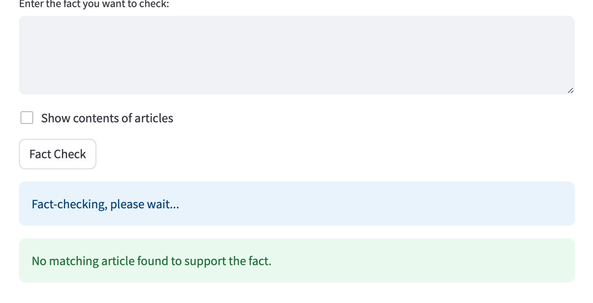
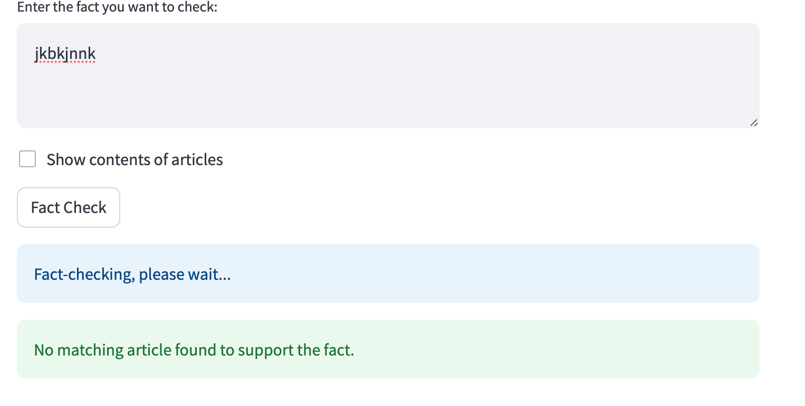
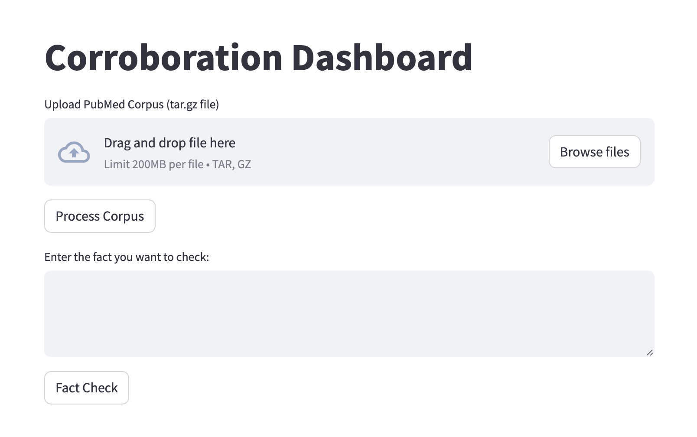
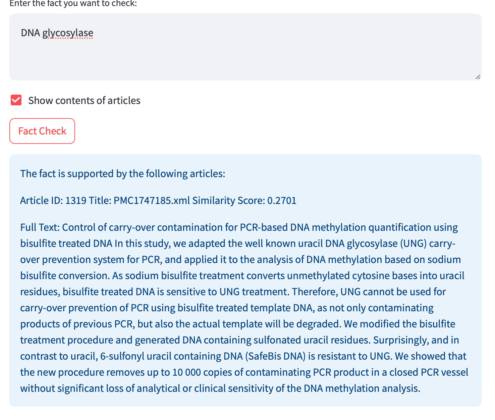

[](https://classroom.github.com/a/Y4rZMh1t)
# Junior Seminar (CMPSC 580) Exemplar Project Repository

## Semester: Spring 2024

This repository contains student project materials, including project report, data, code, and references to literature for this departmentally-sponsored project. __As you complete each of the below sections in this document, please be sure to remove the preamble text so that it does not appear in your work.__ Please work with your first reader to answer any questions or concerns that you may have.

## GitHub Handle: rodriguez03

## Name: Sabrina Rodriguez

## Major: Computer Science (DS)

## 🧢 🆃🅷🅰🆃🆂 🅰 🅵🅰🅲🆃 🅽🅾 🅲🅰🅿 🧢

---

## Overview

The purpose of this project aims to elevate the effectiveness of using machine learning for text analysis, specifically in the development of a fact-checking system. Its primary objective is to optimize the utilization of text analysis tools, catering to users such as students, researchers, or anyone interested on validating the accuracy of factual information. The project focuses on streamlining the processing of a corpus containing PubMed articles, extracting crucial textual content, and facilitating users in conducting fact-checks through an interface. In an era characterized by information overload, the project becomes essential in ensuring the credibility of facts. Through the integration of scholarly articles into the fact-checking domain, the Corroboration Dashboard strives to offer a more inclusive, automated, and dependable approach to information verification, thereby contributing significantly to the progress of research and knowledge validation. The primary research question revolves around how effectively the system can corroborate user-provided facts with information present in the scholarly articles. Overall, this project attempts to help the need for an automated corroboration mechanism in the domain of scholarly research.

## 📝 Literature Review 📝

The Corroboration Dashboard project represents a pivotal advancement in the domain of information verification and fact-checking, responding to the exigencies identified in the existing body of literature related to text analysis, machine learning, and knowledge validation. A thorough literature review reveals that contemporary challenges associated with misinformation and the credibility of textual content have spurred diverse research endeavors across multiple domains, including journalism, information retrieval, and natural language processing.

Prior research has explored the application of machine learning algorithms to assess the credibility and authenticity of textual content. While these studies have laid a foundation for automated fact-checking, they often grapple with challenges such as scalability, precision, and the ability to handle diverse datasets. The Corroboration Dashboard project builds upon this corpus of knowledge by introducing a novel methodology grounded in the systematic processing of scholarly articles sourced from PubMed.

The literature also highlights a growing concern regarding the limitations of existing fact-checking methodologies in the face of evolving information sources. As the landscape diversifies, traditional fact-checking practices confront difficulties in maintaining relevance and accuracy. The Corroboration Dashboard project addresses and extends these challenges by integrating scholarly articles into the fact-checking landscape, offering a distinctive contribution that leverages the rigor of academic discourse to enhance the verification process.

Several scholarly works have emphasized the pressing need for innovative fact-checking solutions in contemporary society. The Corroboration Dashboard project emerges as a promising initiative, not merely aligning with prior research insights but introducing a novel paradigm for information validation. By harnessing the depth and reliability embedded in scholarly articles, this project provides a unique and valuable contribution to the ongoing discourse on information credibility and fact-checking methodologies. In this context, the project's focus on PubMed articles as a rich source of validated information represents a distinctive approach that holds the potential to reshape how fact-checking is approached in an era marked by information abundance and complexity.

## ❓🤔 Methods 🤔❓

***Explanation of Code***

The project started with examining PubMed articles in order to gain insights on the type of information within these datasets. Examining contents such as the size and structure was crucial in determining the logistical aspects of running this project. The first essential steps in starting was downloading the data from the [PubMed]((https://ftp.ncbi.nlm.nih.gov/pub/pmc/oa_bulk/)) website. After ensuring one file was able to process, the program begins by parsing and reading through the data within the XML files.

```python
def extract_data_from_xml(xml_path):
    """Extract and process data from XML Files."""
    with open(xml_path, 'r', encoding='utf-8') as file:
        soup = BeautifulSoup(file, 'xml')
        title_tag = soup.find('article-title')
        title = title_tag.text.strip() if title_tag else ""
        
        abstract_tag = soup.find('abstract')
        abstract = abstract_tag.text.strip() if abstract_tag else ""

        text = title + " " + abstract
        return text
```

The provided Python code snippet illustrates a function named `extract_data_from_xml`, which is designed to extract and process data from XML files. This function utilizes the BeautifulSoup library to navigate and extract information such as the article title and abstract from the XML files. The extracted data is then consolidated into a text format.Moving forward, the code includes functionalities for processing the entire corpus of XML files. The `process_chunk` function facilitates the batch processing of a specified chunk of XML files, inserting relevant data into a SQLite database named "corroboration_db.sqlite."

```python
def process_chunk(conn, cursor, chunk):
    with conn:
        for xml_path in chunk:
            text = extract_data_from_xml(xml_path)
            cursor.execute('INSERT INTO articles (title, text) VALUES (?, ?)', (os.path.basename(xml_path), text))
    conn.commit()
```

The `process_corpus` function orchestrates the overall processing of XML files, systematically walking through the corpus directory, assembling chunks of XML paths, and persistently storing data into the SQLite database.

Additionally, the code encompasses a fact-checking mechanism. The `fact_check` function accepts a user-provided query, retrieves data from the articles stored in the database, and employs the Term Frequency-Inverse Document Frequency (TF-IDF) vectorization technique to determine similarity scores. Articles with similarity scores exceeding a specified number are considered as potential matches, and the results are presented to the user through the Streamlit application. The addition of the show_contents checkbox to show whether to display the full text of the articles is a useful feature. This allows users to decide whether they want to see detailed contents along with the fact-checking results.

The main application, defined in the `main` function, operates within the Streamlit framework. It enables users to upload a PubMed corpus in tar.gz format, process the corpus, and perform fact-checking by entering a query. The application provides informative messages and results, creating a comprehensive Corroboration Dashboard for user interaction and insights.

***Testing*** 

To test the validity of this project, I took the approach to manually test each input data of different facts. For example, I tested a scenario in which a user would type in gibberish to ensure that the program would recognize that it is an input that is not within the data file. I also tested what the programs output would look like if the user typed in nothing within the text box. If the output of the program is `No matching article found to support the fact` than it was ran correctly.  The output of both test is demonstrated below: 




## Using the Artifact

***Installation***

1. To run the provided Python code for the project, the user would need to install several external libraries:

1. **Streamlit**: For creating web applications with minimal effort.
    ```bash
    pip install streamlit
    ```

2. **SQLite3**: For interacting with SQLite databases.
    ```bash
    # SQLite3 is typically included with Python installations, so a separate installation may not be necessary
    ```

3. **BeautifulSoup**: For parsing HTML and XML files.
    ```bash
    pip install beautifulsoup4
    ```

4. **scikit-learn**: For machine learning functionalities such as TF-IDF vectorization and cosine similarity calculation.

    ```bash
    pip install scikit-learn
    ```

5. **tarfile**: For handling tar.gz file extraction.
    ```bash
    # tarfile is a standard library module and usually does not require a separate installation
    ```

6. **nltk (Natural Language Toolkit)**: May be required for additional text processing tasks.
    ```bash
    pip install nltk
    ```

***How to run the Program***

1. Download a PubMed File onto laptop (make sure you have a significant amount of space when downloading large data files)

2. Run the command `streamlit run main.py` into your terminal to run the program. It should take your screen onto your local browser and open a tab to which you'll see the program. It should appear as the following: 



3. Browse through your file onto the corpus and click on the appropiate data. Afterwards click on `Process Corpus`


4. After the file has been successfully processed, enter a fact or a key word in which you want to explore and 🎉 **TAAADAAAA** 🎉 your articles should be given to you!



## Results and Outcomes

The outcomes of this project showcase a significant advancement in the application of machine learning for text analysis, particularly in the domain of fact-checking systems. The theoretical foundation of the project lies in the integration of scholarly articles from the PubMed corpus, enabling a comprehensive analysis of textual content. Through the implementation of TF-IDF vectorization and cosine similarity, the fact-checking system successfully identifies relevant articles that support or corroborate a given fact. An enhanced artifact, the Corroboration Dashboard, demonstrates its capabilities through a user-friendly interface, allowing users such as students, researchers, and anyone interested in fact verification to easily interact with the system.

Evaluation metrics for the artifact involve measuring the system's accuracy in identifying supporting articles and providing relevant information to users. Additionally, the scalability and efficiency of the system are crucial metrics, considering the vast amount of data present in the PubMed corpus. The Corroboration Dashboard addresses these metrics by incorporating a streamlined processing pipeline and a similarity threshold that users can adjust based on their preference for precision. In the future, I would like to enhance this project by providing a mechanism in which the program can process the data faster. It is not efficient especially with large data files.

## References

- Alpaydin, E. (2021). Machine learning. Mit Press.

- Bengfort, B., Bilbro, R., & Ojeda, T. (2018). Applied text analysis with Python: Enabling language-aware data products with machine learning. " O'Reilly Media, Inc.".

- Ke, S., Olea, J. L. M., & Nesbit, J. (2019). A robust machine learning algorithm for text analysis. working paper.

- Thorne, J., & Vlachos, A. (2018). Automated fact checking: Task formulations, methods and future directions. arXiv preprint arXiv:1806.07687.

- Jordan, M. I., & Mitchell, T. M. (2015). Machine learning: Trends, perspectives, and prospects. Science, 349(6245), 255-260.

- Vo, N., & Lee, K. (2019, July). Learning from fact-checkers: Analysis and generation of fact-checking language. In Proceedings of the 42nd International ACM SIGIR Conference on Research and Development in Information Retrieval (pp. 335-344).


---

## Exemplar Projects Discussions

The department's project descriptions can be found at [https://github.com/ReadyResearchers-2023-24/cmpsc-580-exemplar-projects](https://github.com/ReadyResearchers-2023-24/cmpsc-580-exemplar-projects)

## Schedule

The schedule for this work can be found at [https://github.com/CMPSC-580-Allegheny-College-Spring-2024/classDocs?tab=readme-ov-file#schedule](https://github.com/CMPSC-580-Allegheny-College-Spring-2024/classDocs?tab=readme-ov-file#schedule)